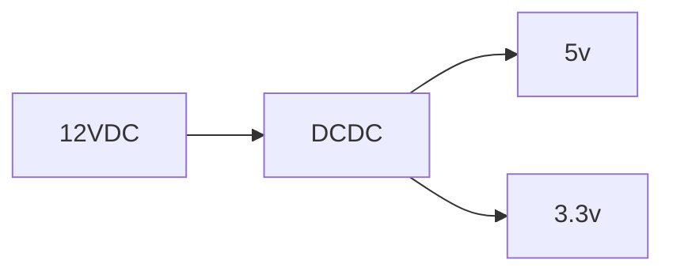

!!! Important
    Documenting your project is just as important as what you're building.  
    
    In 12 months time do you think you'll remember where you were at?

## Location and Customisation
All project documentation lives in the projects 'docs' directory and written in mark-down format that's easy to update, especially with tools like [VSCode](https://code.visualstudio.com/).  

Feel free to change navigation and headings as required to suit your personal style.

See [mkdocs-material documentation](https://squidfunk.github.io/mkdocs-material/) for more information.

## Viewing Locally

To view or update locally

```bash
make serve
```
This will start up the mkdocs local server and your projects documentation will be available in your browser.

`http://localhost:8000`

## Making changes

Any changes to the document files or mkdocs.yml will be automatically updated, with a page refresh, on the local server view each time you save, so allows you to see the changes as you mae them.

## Github pages

Project documentation will automatically be pushed to the projects github pages when updates / merges are applied to the Master branch only if the projects pages is enabled in the github panel.

### Google Analytics

To enable google analytics on your projects github page

1. create a repository secret called `GOOGLE_ANALYTICS_KEY`
2. copy your google site tracking key into the new secret.
3. in `mkdocs.yml` uncomment the google analytics found at the bottom of the file
4. Now each time your project site is deployed it will be updated with the google analytics key.

```yaml
google_analytics:
  - !!python/object/apply:os.getenv ["GOOGLE_ANALYTICS_KEY"]
  - auto
```

## Diagrams using Mermaid

````markdown

````

